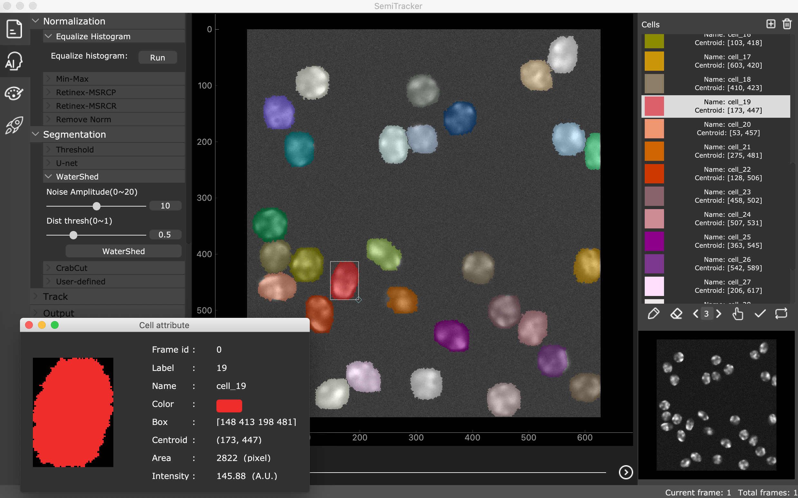

# CellTracker: An Automated Toolbox for Single-Cell Segmentation and Tracking in Microscopy Images

By [Tao Hu](https://gitlab.com/ecart18) & [Shixiong Xu](https://gitlab.com/xsx1001).

The code for the official implementation of **CellTracker**. You can find the [Tutorial](doc/CellTrackerTutorial.pdf) in doc folder.

This codebase provides: 
- A GUI for cell image normalization
- A GUI for cell image segmentation
- A GUI for cell image tracking
- A GUI for manual correction 
- A GUI for cell property profiling and intensity quantification
- A GUI for training data annotation
- A GUI for deep CNN model training
- A Python API for deep CNN model training


## Contents
1. [Introduction](#introduction)
2. [Environment Setup](#environment-setup)
3. [Bibtex](#bibtex)

## Introduction <a name="introduction">
CellTracker is a highly integrated graphical user interface software, for automated cell segmentation and tracking of time-lapse microscopy images. It covers essential steps in image analysis, including project management, image pre-processing, cell segmentation, cell tracking, manual correction, and statistical analysis such as the quantification of cell size and fluorescence intensity. Furthermore, CellTracker provides an auxiliary annotation tool and supports model training from scratch, thus providing a flexible and scalable solution for customized datasets.

<div align='center'><br></div>


## Environment Setup <a name="environment-setup">

**Env Requirements:** 
- MAC OS, Linux or Windows.
- Python 3.5+.
- PyTorch 1.4 or higher.
- CUDA 9.2 or higher if you need train deep learning model with gpu.

**Steps of using CellTracker:** 

0. Install Python ref to [Download Python](https://www.python.org/downloads/)

1. Install CellTracker in virtualenv to keep your environment clean:

    ##### on macOS/Linux
    ```
    pip install virtualenv  # or pip install -i https://pypi.tuna.tsinghua.edu.cn/simple virtualenv 
    virtualenv --python=python3 CellTrackerEnv
    cd CellTrackerEnv
    source ./bin/activate
    ```
    Optional: After use, shutdown virtual environment with
    ```
    deactivate
    ```

    ##### on Windows
    ```
    pip install virtualenv  # or pip install -i https://pypi.tuna.tsinghua.edu.cn/simple virtualenv 
    virtualenv --python=python3 CellTrackerEnv 
    cd CellTrackerEnv
    .\Scripts\activate.bat
    ```
    Optional: Shutdown virtual environment with
    ```
    .\Scripts\deactivate.bat
    ```

2. Download or clone the source codes with git. 
    ```
    git clone https://gitlab.com/ecart18/cell-tracker.git
    ```
    To boost download speeds, you could clone CellTracker from the source in the mainland of China.
    ```
    git clone https://gitee.com/ecart18/cell-tracker.git
    ```
3. Extract files and put it in the virtual environment directory you defined. The directory of CellTracker should have the following structure:
    
    ```
    CellTrackerEnv
        cell-tracker
            |-------main.py
            |
            |-------cell_tracker
                    |...
                    |...
            |-------datasets
                    |...
            |-------log
            |-------output
            |-------training_demo1
            |-------training_demo2
            |...
        |...
    ```

4. After the extraction, download all dependencies with the following commend.
    ```
    cd cell-tracker
    pip install -r requirements.txt
    ```
    To boost download speeds, you could setup pip mirror such as
    ```
    pip install -i https://pypi.tuna.tsinghua.edu.cn/simple -r requirements.txt  
    # or
    pip install -i https://mirrors.aliyun.com/pypi/simple  -r requirements.txt
    ```
    It is recommended to use the official website to install pytorch.
    ```
    # CPU version
    pip install torch==1.4.0+cpu torchvision==0.5.0+cpu -f https://download.pytorch.org/whl/torch_stable.html
    # GPU version
    pip install torch==1.4.0 torchvision==0.5.0 -f https://download.pytorch.org/whl/torch_stable.html
    ```

5. Run CelTracker with python and enjoy it. 
    ```
    python main.py
    ```

**Steps of re-training deep learning model:** 

CellTracker provides two methods to re-train deep CNN networks for your customized datasets. 

**Warning:** Linux is strongly recommended for training deep learning model. Re-training with the Python API in a Linux terminal can avoid some unexpected environment dependency errors.

0. re-training with User Interface.

1. re-training with Python API in terminal.  CellTracker provides two demo datasets and codes to help you get familiar with this feature, such as: 
    ```
    cd training_demo1  # or cd training_demo2
    python retraining.py
    ```

**Pretrained models download:** 

CellTracker provides two pretrained models for dataset of training_demo1 and training_demo2 respectively. Download them from the following link.
- [demo1 pretrained model](https://drive.google.com/file/d/1wekBJbzG8m5EyeeyVqx56vhdz_TnIxab/view?usp=sharing)
- [demo2 pretrained model](https://drive.google.com/file/d/1HyqStKlTPX_K94F6n2OHytSzs40zffU8/view?usp=sharing)


## Bibtex<a name="bibtex">
Please consider citing our paper in your publications if the project helps your research. BibTeX reference is as follows.

```
@article{,
  title={CellTracker: An Automated Toolbox for Single-Cell Segmentation and Tracking in Microscopy Images},
  author={Hu, Tao and Xu, Shixiong and Wang, Xiaowo},
  journal={},
  year={2020}
}
```

## License
For academic use, this project is licensed under the GNU Lesser General Public License v3.0 - see the LICENSE file for details. For commercial use, please contact the authors. 